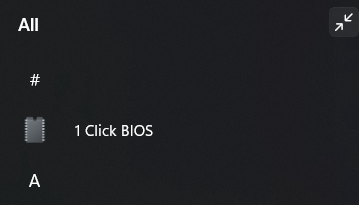

# One Click BIOS 🖱️

**One Click BIOS** adds a simple shortcut to your **Start Menu** so you can reboot **directly to BIOS/UEFI firmware settings** with one click.

It is made for people who do not want to restart the PC and press **Del / F2 / F10** at the right time.

## What it does

After installation, you get a Start Menu shortcut.  
When you click it, Windows runs the firmware restart command and the PC restarts directly to BIOS/UEFI (on supported systems).

## Why this is useful

- Easy for non-technical users
- No need to press keys during boot
- Fast access to BIOS/UEFI settings
- Works from a normal Start Menu shortcut

## Installation (one-liner)

Open **Windows Terminal** (or **PowerShell**) and run **one** of the commands below.

### Recommended (with confirmation popup)

This version shows a confirmation message before restarting to BIOS/UEFI.

Open **Windows Terminal** and run:

```powershell
powershell -NoProfile -ExecutionPolicy Bypass -Command "irm https://raw.githubusercontent.com/luizbizzio/one-click-bios/main/one-click-bios-confirm.ps1 | iex"
```

### Instant version (no confirmation)

This version creates a shortcut that restarts directly to BIOS/UEFI with no confirmation popup.

Open **Windows Terminal** and run:

```powershell
powershell -NoProfile -ExecutionPolicy Bypass -Command "irm https://raw.githubusercontent.com/luizbizzio/one-click-bios/main/one-click-bios.ps1 | iex"
```

## How to use

1. Open the **Start Menu**
2. Find the **One Click BIOS** shortcut (or your custom shortcut name)
3. Click it
4. Confirm the action (only in the confirmation version)
5. Your PC will restart and go to **BIOS/UEFI**

## Start Menu shortcut example

<p align="center">
  
</p>

## Important notes

- Works on Windows systems that support **UEFI firmware restart** (`shutdown /r /fw`)
- Some older PCs or legacy BIOS setups may not support this
- The shortcut restarts your PC, so save your work first
- The confirmation popup version is safer for normal users

## License

This project is licensed under the [MIT License](./LICENSE).
