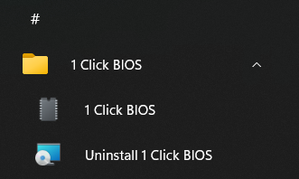

<h1 align="center">One Click BIOS 🖱️</h1>

<p align="center">
  Add a clean <strong>Start Menu folder</strong> that lets you reboot straight into <strong>BIOS / UEFI</strong> with a confirmation popup and an uninstall shortcut.
</p>

---

## ✨ What this does

After installation, you get a **Start Menu folder** called **1 Click BIOS** with:

- **1 Click BIOS**
- **Uninstall 1 Click BIOS**

When you click **1 Click BIOS**, a confirmation popup appears.
If you confirm, Windows runs the firmware restart command and reboots directly into **BIOS / UEFI** on supported systems.

This is useful if you do not want to restart and spam keys like **Del**, **F2**, or **F10** at the right moment.

---

## 📥 Installation

Open **Windows Terminal** or **PowerShell** and run:

```powershell
powershell -NoProfile -ExecutionPolicy Bypass -Command "$ProgressPreference='SilentlyContinue'; $u='https://raw.githubusercontent.com/luizbizzio/one-click-bios/main/one-click-bios.ps1'; $c=(Invoke-WebRequest -UseBasicParsing $u).Content; & ([ScriptBlock]::Create($c)) -ScriptUrl $u"
```

---

## 🗂️ Start Menu example

This is how the folder looks after installation:

<p align="center">
  
</p>

---

## ✅ Why use this

- Faster access to **BIOS / UEFI**
- No need to catch the boot screen
- Cleaner for normal users
- Confirmation popup before reboot
- Includes a built-in uninstall shortcut
- Installs only for the **current user**

---

## 🧩 What gets installed

This installer creates:

- a **Start Menu folder** named **1 Click BIOS**
- a **main shortcut** with confirmation popup
- an **uninstall shortcut**
- a **per-user Scheduled Task**
- helper files inside your **user profile**

---

## ⚠️ Important notes

- Works on Windows systems that support **UEFI firmware restart** using `shutdown /r /fw`
- Some older systems or legacy BIOS setups may not support this
- Save your work first, because this will restart the PC
- The install may request **administrator permission**
- The Scheduled Task is created **for the current user**
- The reboot shortcut shows a confirmation popup before restarting

---

## 📁 Files created

This installer creates user-level items such as:

- Start Menu shortcuts
- a helper launcher in your user profile
- an uninstall script in your user profile
- a per-user Scheduled Task

---

## 📄 License

This project is licensed under the [MIT License](./LICENSE).
